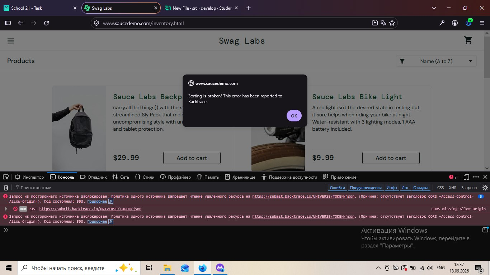

# Задание 3. Составление баг-репорта

### Дефект на ресурсе https://www.saucedemo.com/

---

## 1. Баг-репорт S21-01

| Поле | Описание / Значение |
| :--- | :--- |
| Уникальный номер (ID) | S21-01 |
| Заголовок | Не работает сортировка товаров у пользователя error_user |
| Проект | [Сайт SauceDemo](https://www.saucedemo.com/) |
| Описание | После авторизации под пользователем error_user на главной странице каталога не работает сортировка товаров. При попытке выбрать любой вариант сортировки из выпадающего списка ("Name (Z to A)", "Price (low to high)", "Price (high to low)") появляется системное всплывающее окно с ошибкой: Sorting is broken!. |
| Предусловия | Открыт браузер, перешли на главную страницу авторизации: https://www.saucedemo.com/ |
| Серьезность (Severity) | Major (Высокая) |
| Приоритет (Priority) | Medium (Средний) |
| Статус | Новый |
| Автор | Dimesfar |
| Исполнитель | Proger007 |
| Шаги к воспроизведению | 1. В поле Username ввести error_user. 2. В поле Password ввести secret_sauce. 3. Нажать кнопку Login. 4. Кликнуть на выпадающий список сортировки (в верхнем правом углу каталога). 5. Выбрать вариант сортировки Price (low to high) (или любой другой, отличный от текущего). |
| Фактический результат | Сортировка списка товаров не происходит. Появляется всплывающее окно браузера (alert) с текстом ошибки: Sorting is broken!.This error has been reported to Backtrace. |
| Ожидаемый результат | Товары успешно пересортировываются согласно выбранному критерию (по названию или по цене). Всплывающие окна с ошибками отсутствуют. |
| Окружение | ОС Windows 10 Home (64-bit), браузер Mozilla Firefox 128.0 (64-bit), ноутбук Acer|
| Логи / Console (DevTools) |  В консоли браузера фиксируется необработанное исключение / ошибка вызова скрипта: Error: Sorting is broken! / заблокированный сетевой запрос: Запрос из постороннего источника заблокирован: политика одного источника запрещает чтение удаленного ресурса... Код состояния: 503 (запрос к https://submit.backtrace.io/) |
| Вложения |  |
| Дополнительная информация| Проблема воспроизводится стабильно 100% времени при авторизации под аккаунтом error_user. На аккаунте standard_user функция работает корректно. |

---

## 2. Почему это баг, а не фича?

Данное поведение является дефектом (багом) по следующим причинам:

1. Нарушение функциональных требований: Сортировка товаров — ключевая базовая функция каталога интернет-магазина. Она должна работать стабильно для всех авторизованных пользователей.
2. Несоответствие ожиданиям пользователя (UX/UI): Пользователь ожидает изменить порядок отображения карточек товаров. Вывод необработанного диалогового окна alert вредит пользовательскому опыту и свидетельствует о сбое в коде.
3. Отсутствие документации и предупреждений: На странице авторизации и в интерфейсе отсутствуют какие-либо явные предупреждения о том, что для аккаунта error_user намеренно ограничена функциональность сортировки.
4. Сравнение с эталонным поведением: У пользователя standard_user сортировка выполняется корректно. Разница в поведении одной и той же функции под разными учетными записями без явных бизнес-правил указывает на дефект.

---

## 3. Гипотеза о причинах и способах устранения

### Технические предположения:

1. Зашитая логика для тестового аккаунта:  
   Учитывая название учетной записи error_user, в клиентском коде (JS) с высокой вероятностью присутствует искусственное условие перехвата:  
   if (currentUser === 'error_user') { alert('Sorting is broken!'); }

2. Некорректная обработка данных или структура массива:  
   Функция сортировки рассчитывает на определенный массив объектов товаров, но для пользователя error_user приходят неполные данные или данные другого типа (null / undefined), из-за чего падают методы .sort() или .reverse().

3. Сбой авторизации/прав доступа на уровне API (RBAC):  
   Запрос на получение отсортированного списка отклоняется сервером или возвращает некорректный HTTP-статус из-за неверно переданного токена или прав учетной записи.

### Способы устранения:
* Провести рефакторинг JavaScript-кода, отвечающего за обработку события onChange у селектора сортировки, и удалить искусственные ограничения для error_user.
* Добавить валидацию и безопасную обработку ошибок (try...catch) при вызове функции сортировки массива товаров.
* Обеспечить единую структуру данных карточек товаров вне зависимости от авторизованного профиля.

---

## 4. Влияние на пользователя и бизнес (Business Impact)

* Падение конверсии и прямые финансовые потери: Пользователи не могут быстро найти нужный или наиболее выгодный товар, из-за чего отказываются от покупки и уходят к конкурентам.
* Снижение удобства использования (Usability): При большом ассортименте ручной поиск товаров занимает значительно больше времени и вызывает раздражение.
* Рост нагрузки на службу поддержки: Необработанные ошибки вызывают волну однотипных обращений и жалоб от клиентов в техподдержку.
* Потеря доверия к бренду: Появление технических всплывающих окон снижает уровень доверия к безопасности и надежности интернет-магазина.

## 5. Использование ИИ для улучшения баг-репорта

### 5.1. Промпт для нейросети
> Запрос (Prompt):  
> «Предложи 3 варианта заголовка для баг-репорта по принципу "Что? Где? Когда?" на основе следующего описания: у пользователя error_user на сайте SauceDemo не работает сортировка товаров и вылезает ошибка.  Также проверь шаги к воспроизведению на полноту и понятность для разработчика и предложи правки.»

---

### 5.2. Предложенные нейросетью варианты заголовков ("Что? Где? Когда?")

1. Вариант 1 (Краткий):  
   Ошибка «Sorting is broken!» при попытке сортировки товаров в каталоге под пользователем error_user
   * Что: Появляется ошибка «Sorting is broken!».
   * Где: В каталоге товаров.
   * Когда: При попытке сортировки под пользователем error_user.

2. Вариант 2 (Детализированный):  
   Не перестраивается список товаров и выводится системный alert при выборе любой сортировки под аккаунтом error_user
   * Что: Список товаров не перестраивается, выводится системный alert.
   * Где: В списке товаров.
   * Когда: При выборе любой сортировки под аккаунтом error_user.

3. Вариант 3 (Полный — Лучший):  
   Появление ошибки «Sorting is broken!» и сбой сортировки товаров в каталоге при выборе любого фильтра под пользователем error_user
   * Что: Сбой сортировки и появление ошибки «Sorting is broken!».
   * Где: В каталоге товаров (/inventory.html).
   * Когда: При выборе любого фильтра сортировки под пользователем error_user.

---

Выбранный заголовок: Вариант 3

* Точность локализации (Где): Заголовок однозначно указывают разработчику место возникновения ошибки — каталог товаров.
* Полнота описания симптома (Что): Отражены оба проявления дефекта — как отсутствие перестроения карточек товаров, так и появление конкретного текста ошибки (Sorting is broken!).
* Условия воспроизведения (Когда): Указан конкретный тестовый аккаунт (error_user) и целевое действие пользователя (выбор любого фильтра сортировки).

---

### 5.4. Анализ и доработка шагов к воспроизведению

#### Выявленные недочеты исходного черновика:
1. Отсутствие начального шага (открытие главной страницы сайта).
2. Неточные названия элементов интерфейса (отсутствие указания точных англоязычных названий пунктов выпадающего списка).

#### Итоговые доработанные шаги (для размещения в баг-репорте):

Предусловия:
* Открыт браузер Mozilla Firefox на ОС Windows 10 (ноутбук Acer).
* Перешли на страницу авторизации: https://www.saucedemo.com/

Шаги к воспроизведению:
1. В поле Username ввести значение error_user.
2. В поле Password ввести значение secret_sauce.
3. Нажать кнопку Login.
4. В правом верхнем углу каталога кликнуть на выпадающий список сортировки (по умолчанию Name (A to Z)).
5. Выбрать вариант сортировки Price (low to high) (или любой другой альтернативный фильтр).

Фактический результат:  
Товары не сортируются. Отображается системное диалоговое окно (alert) с текстом: Sorting is broken! This error has been reported to Backtrace. В консоли DevTools фиксируется сбой запроса отправки отчета.

Ожидаемый результат:  
Карточки товаров перестраиваются согласно выбранному параметру фильтрации. Всплывающие диалоговые окна с ошибками отсутствуют.

---

### 5.5.
 Итог работы с ИИ и принятые решения

В ходе оптимизации баг-репорта с помощью нейросети были приняты ключевые рекомендации по структурированию заголовка по формуле «Что? Где? Когда?», что сделало его точным, емким и сразу понятным для разработчика. Также было принято решение уточнить фактический результат точным текстом из всплывающего окна alert и зафиксировать сетевые ошибки из консоли браузера (503 / CORS), так как явное логирование деталей и контекста ошибки позволяет разработчику быстро идентифицировать место падения в коде и оперативно приступить к исправлению дефекта.