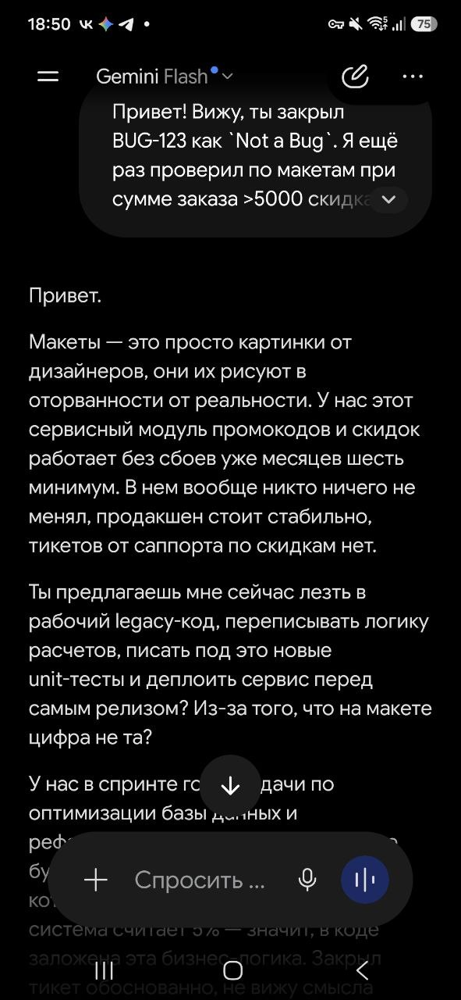
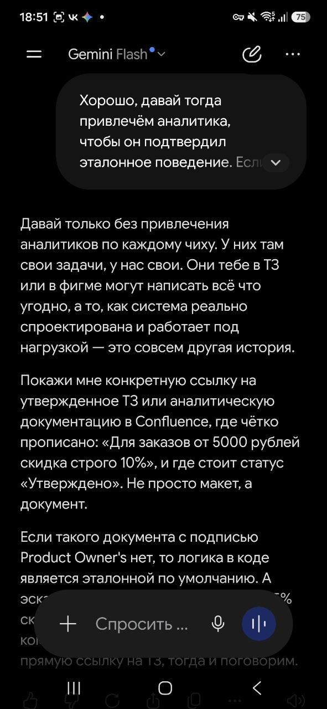

# 

Жизненный цикл баг-репорта и коммуникация в QA

## Часть 1: Таблица этапов жизненного цикла баг-репорта

| Этап / статус | Что происходит | Кто меняет статус | Пример |
| :--- | :--- | :--- | :--- |
| «New» (Новый) | Дефект создан, но в работу ещё не отправлен (возможно, тестировщик уточняет детали) | Статус выставляется автоматически или тестировщиком | Тестировщик создал баг о том, что не работает кнопка в Safari |
| «Open» / «Assigned» (Открыт / Назначен) | Баг проанализирован, подтверждён и назначен на конкретного разработчика | Тимлид / аналитик / менеджер | Тимлид подтвердил баг и назначил на Ивана |
| «In Progress» (В работе) | Разработчик приступил к исправлению | Разработчик | Иван начал искать причину ошибки в коде |
| «Fixed» (Исправлен) | Разработчик считает, что баг исправлен, и передаёт на проверку | Разработчик | Иван залил фикс и написал: "Готово к проверке" |
| «In Testing» (На тестировании) | Тестировщик начал проверку исправления | Тестировщик | Тестировщик пишет: "Приступаю к проверке на Safari" |
| «Verified» (Подтвержден) | Тестировщик проверил исправление. Баг действительно не воспроизводится. Дефект исправлен корректно | Тестировщик | Тестировщик: "Проверил на Safari, кнопка работает, регрессии нет. Верифицировано." |
| «Closed» (Закрыт) | Финальный статус. Баг успешно прошел проверку и закрыт. Обычно означает, что изменения уже ушли в релиз, либо задача полностью завершена и больше не требует никаких действий. | Тестировщик / Тимлид | Тестировщик закрывает задачу после выхода релиза или подтверждения, что фиксация завершена. |
| «Reopened» (Открыт повторно) | Баг не исправлен, либо исправление сломало другой функционал, либо баг найден снова в новом релизе | Тестировщик | "Проверил на билде 1.2.3 — проблема вернулась, открываю снова" |
| «Rejected» / «Not a Bug» (Отклонен) | Разработчик считает, что это не баг, а фича или ошибка тестировщика | Разработчик / аналитик | "Это не баг, так работает дизайн-система" |
| «Duplicate» (Дубликат) | Такой баг уже был зарегистрирован ранее | Разработчик / тестировщик | "Это дубль BUG-1234, закрываю как дубликат" |
| «Need More Info» (Требуются уточнения) | Не хватает информации для воспроизведения | Разработчик | "Приложи, пожалуйста, HAR-файл с запросами" |
| «Can’t Reproduce» (Не воспроизводится) | Разработчик не смог воспроизвести баг у себя. Требуется дополнительная проверка или уточнение данных | Разработчик | "На моей Windows всё работает, попробуй почистить кэш" |
| «Deferred» / «Postponed» (Отложен) | Баг признан, но его исправление отложено до следующего релиза/спринта | Менеджер / тимлид | "Опечатка не критична для бизнеса, переносим в следующий спринт" |

---

## Часть 2: Конфликтные сценарии и стратегия коммуникации

### Сценарий 1: Разработчик говорит «Not a Bug» (Это не баг)

Контекст:  
Найден серьёзный логический дефект в расчёте скидки. Разработчик перевёл баг в статус Rejected с комментарием «Так было всегда / это не баг».

#### Пошаговая стратегия действий:
1. Не переоткрывать сразу — это приведёт к «войне статусов» и лишнему негативу.
2. Перейти в личное общение — написать в мессенджер или обсудить голосом, чтобы аргументированно понять позицию разработчика без эмоций.
3. Вернуться к требованиям — сверяемся с ТЗ и макетами. Если есть расхождения — привлекаем аналитика/продукт-овнера как арбитра.

#### Шаблоны коммуникации:

* Разработчику (первое сообщение):
  > «Привет! Вижу, ты закрыл BUG-123 как Not a Bug. Я ещё раз проверил по макетам: при сумме заказа >5000 скидка должна быть 10%, а сейчас применяется 5%. Подскажи, я опираюсь на неактуальные требования или есть техническое ограничение? Хочу понять, как нам прийти к общему решению.»

* Если разработчик настаивает на своём:
  > «Хорошо, давай тогда привлечём аналитика, чтобы он подтвердил эталонное поведение. Если текущая логика (5%) верна по бизнес-требованиям — я закрою баг и обновлю документацию. Если нет — договоримся о сроках фикса.»

* Аналитику (привлечение арбитра):
  > «Коллеги, у нас с разработчиком расхождение по BUG-123. Я тестирую по актуальным макетам (скидка 10%), разработчик говорит, что код работает корректно по старым требованиям (5%). Не могли бы вы прояснить, какое поведение ожидаемо сейчас?»

---

### Сценарий 2: Баг не воспроизводится на среде у разработчика («Can’t Reproduce»)

Контекст:  
Критичный баг стабильно воспроизводится на тестовом стенде, но разработчик не может его повторить локально и планирует закрыть задачу.

#### Пошаговая стратегия действий:
1. Подготовить доказательную базу — проверить логи, консоль, записать свежее видео со временем и окружением.
2. Предложить совместную сессию — показать экран в Zoom/Teams или вместе дебажить на тестовом стенде.
3. Провести чистый эксперимент — проверить в инкогнито, сбросить кэш, проверить под другой учетной записью.
4. Исключить сетевые и инфраструктурные проблемы — при необходимости привлечь DevOps.

#### Шаблоны коммуникации:

* Первое сообщение разработчику:
  > «Привет! Понимаю, что локально не ловится. Я перепроверил на тестовом стенде — баг стабильно воспроизводится (приложил свежее видео). Может, дело в версии БД или конфигурации сервиса? Давай я на 5 минут покажу проблему вживую? Или запишу видео с консолью браузера, чтобы ты увидел ошибки.»

* Если разработчик предлагает закрыть баг:
  > «Давай не закрывать — на проде конфигурация идентична стенду, пользователи гарантированно с этим столкнутся. Предлагаю:
  > 1. Я сброшу кэш и перезалью билд на стенде.
  > 2. Мы вместе посмотрим логи или подебажим на стенде.
  > Если баг только на стенде — будем чинить стенд, если в коде — код. Главное — не пустить проблему в прод.»

* Для привлечения DevOps/Администратора:
  > «Хорошо, давай тогда так: раз локально код работает, а на стейджинге — нет, я привлеку администратора. Уточню, не менялись ли настройки nginx или версии софта на стенде. Как разберёмся — сразу вернусь с новостями.»

### Сценарий 3: Менеджер настаивает закрыть баг или перенести в «Deferred» ради сроков

Контекст:  
Найден критичный дефект перед самым деплоем. Менеджер проекта (PM) просит закрыть баг или перенести его на следующий спринт, чтобы успеть выкатиться в срок.

#### Пошаговая стратегия действий:

1. Не поддаваться эмоциям и давлению — задача QA не спорить из упрямства, а подсветить бизнесу реальные риски.
2. Оценить критичность и влияние (Impact & Severity) — наглядно показать, сколько пользователей затронет ошибка и к каким финансовым или репутационным потерям это приведет.
3. Предложить альтернативные решения — если релиз нельзя перенести, предложить временный костыль (workaround), отключение фичи под фича-флагом или оперативный хотфикс.
4. Зафиксировать ответственность — если менеджер принимает решение релизить с дефектом, это решение должно быть письменно зафиксировано.

#### Шаблоны коммуникации:

Менеджеру (оценка рисков):
> Привет! Понимаю, что мы горим по срокам, но если мы выпустим релиз с BUG-456, около 30% пользователей не смогут завершить оплату через СБП. Это прямой риск потери выручки в день релиза. Давай обсудим, как мы можем минимизировать риски?

Предложение компромисса:
> Если переносить релиз совсем нельзя, предлагаю варианты:
> 1. Временно спрятать кнопку оплаты СБП под фича-флаг и выкатить только банковские карты.
> 2. Выкатываемся сейчас, но разработчик сразу готовит хотфикс, и мы тестируем его в первую очередь завтра утром.
> Подскажи, какой вариант выбираем?

Фиксация решения (если менеджер всё равно берет риск на себя):
> Принято. Направляю фоллоу-ап в чат релиза: баг BUG-456 переносим в Deferred по решению PM, риски по ошибкам оплаты на стороне бизнеса зафиксированы. Закрываю задачу с соответствующей пометкой.

---

### Сценарий 4: Релиз полностью блокируется багом (Blocker), разработчик не успевает пофиксить

Контекст:  
За пару часов до релиза найден блокер (падают автотесты / приложение падает при старте). Разработчик не успевает сделать правку, процесс релиза полностью остановлен.

#### Пошаговая стратегия действий:

1. Локализовать и сузить область проблемы — оперативно предоставить разработчику подробные логи, шаги воспроизведения и окружение, чтобы он не тратил время на поиск.
2. Оповестить команду о блоке (Raise Flag) — сразу подсветить статус блока в релизном чате, чтобы команда не ждала вслепую.
3. Содействие в тестировании — проверить локальную правку разработчика сразу же в приоритетном порядке (Ad-hoc / Smoke).
4. Инициировать обсуждение отката (Rollback) — если фикс занимает слишком много времени, предложить откатить коммит с проблемной фичей.

#### Шаблоны коммуникации:

В релизный чат (подсветка блокера):
> Коллеги, релиз временно заблокирован: найден блокер BUG-789 (приложение падает при авторизации). Баг уже назначен на Ивана, приложил свежие логи и crash-дамп. Время релиза сдвигается, держу в курсе по статусу.

Разработчику (помощь и локализация):
> Вань, я максимально сократил шаги: падает только при пустом профиле пользователя. Вот свежий лог с сервера. Чем я могу помочь, чтобы ускорить воспроизведение? Как только будет готов локальный фикс — зови, я сразу проверю вне очереди.

При затягивании фикса (команде/PM):
> Коллеги, фикс BUG-789 требует переработки логики и займет еще минимум 3–4 часа. Чтобы не сорвать релизный слот, предлагаю откатить коммит с этой фичей и релизить текущий стабильный билд, а задачу отправляем на доработку в следующий спринт.
---

## Часть 3: Использование ИИ

### 1. Промпт для нейросети (для проигрывания сценария 1)

Промт:

Сыграй роль упрямого Senior Backend разработчика по имени Алексей.
Контекст: Я QA-инженер. Я завел баг BUG-123: "Скидка на заказ от 5000 руб рассчитывается как 5% вместо 10%".
Ты перевел баг в статус "Rejected" с комментарием: "Так и должно быть, код не менялся полгода, это не баг".
Твоя задача: Отвечать мне с позиции старшего разработчика, защищать текущую реализацию, ссылаться на занятость и legacy-код, сопротивляться изменениям, пока я не приведу железобетонные аргументы (ссылку на ТЗ от аналитика или предложение привлечь Product Owner's).
Начни диалог после того, как я напишу тебе первое сообщение.

### Анализ и рефлексия по итогам симулированного разговора

Оценка убедительности аргументов:  
Начальные аргументы со ссылкой на макеты встретили сопротивление разработчика («макеты старые, у меня нет времени»). Наиболее убедительным аргументом в симуляции оказалось предложение не спорить о коде, а оперативно привлечь аналитика для подтверждения эталонного бизнес-поведения. Это сняло эмоциональный накал и перевело диалог из конфликта в конструктивное русло.

Чему научил этот разговор:  
* Не нужно вступать в бесконечные споры о том, кто прав, и переоткрывать задачу в таск-трекере без согласования.
* Убедительная стратегия QA — это сохранение нейтралитета, готовность помочь в поиске причин и привлечение арбитра (аналитика/PO), если требования трактуются по-разному.
* Конфликт легко решает смещение фокуса на общую цель — не пустить баг к пользователям на прод.

### Скриншоты симуляции диалога с ИИ

