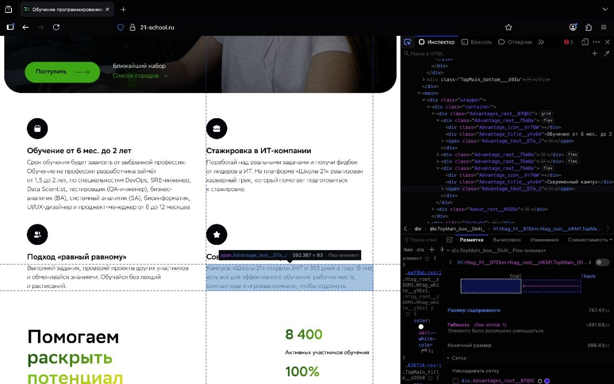
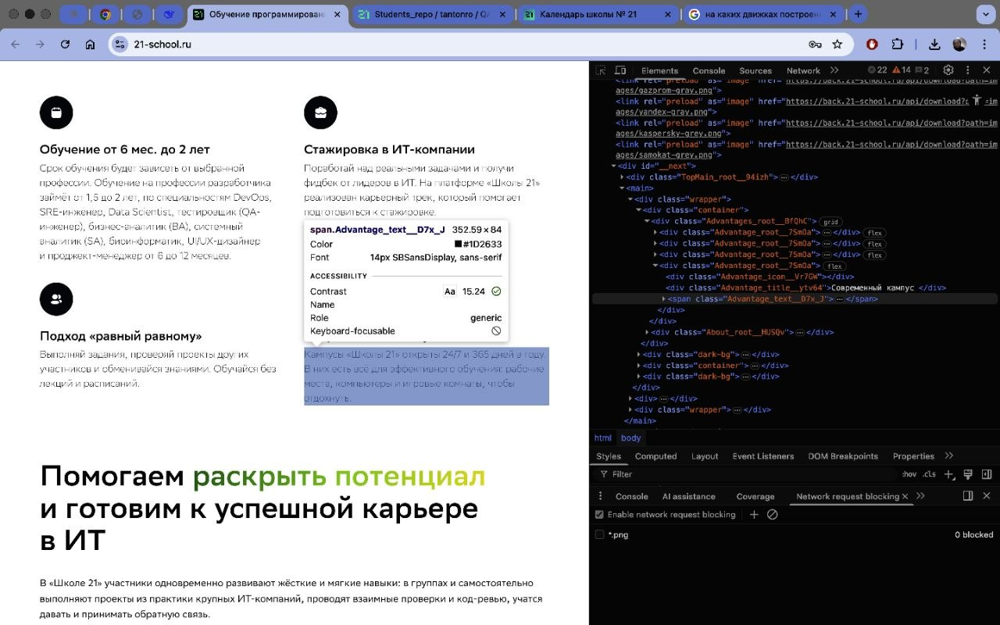
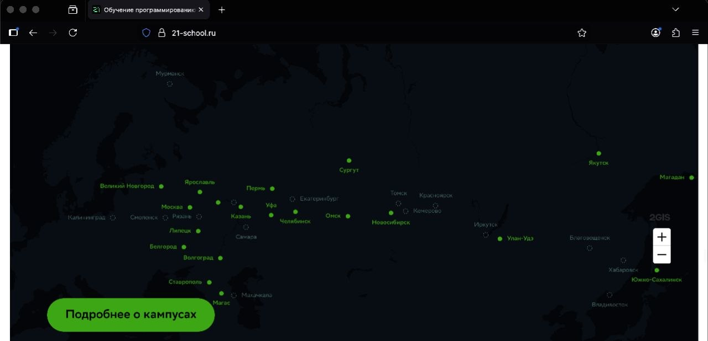
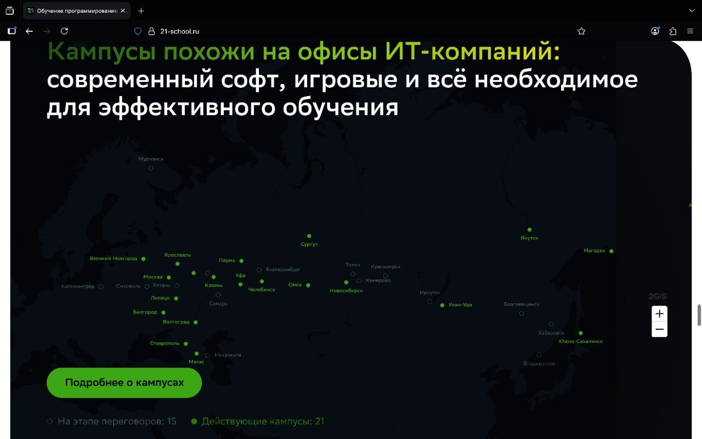
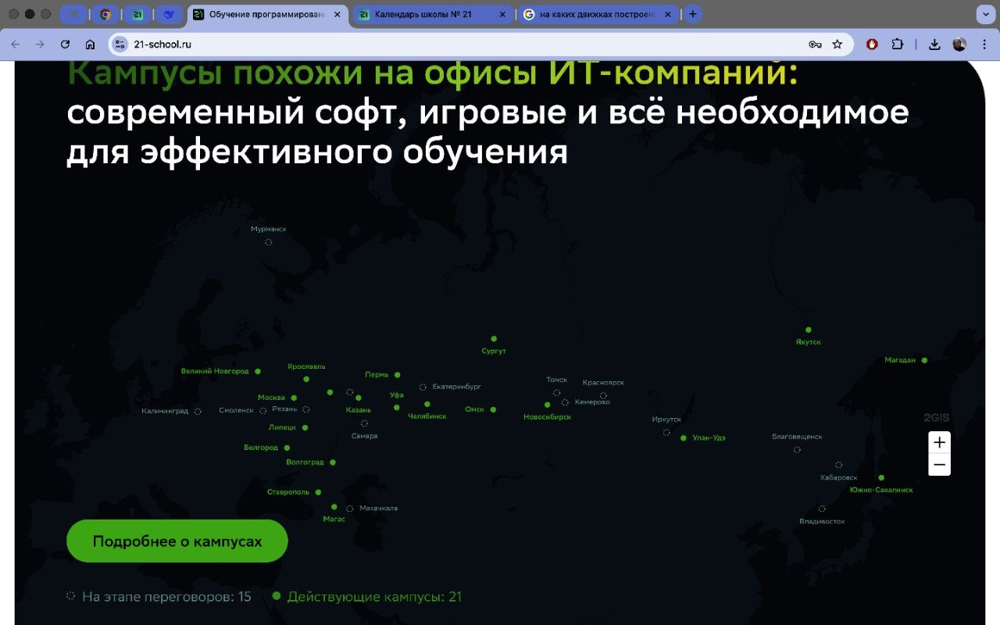
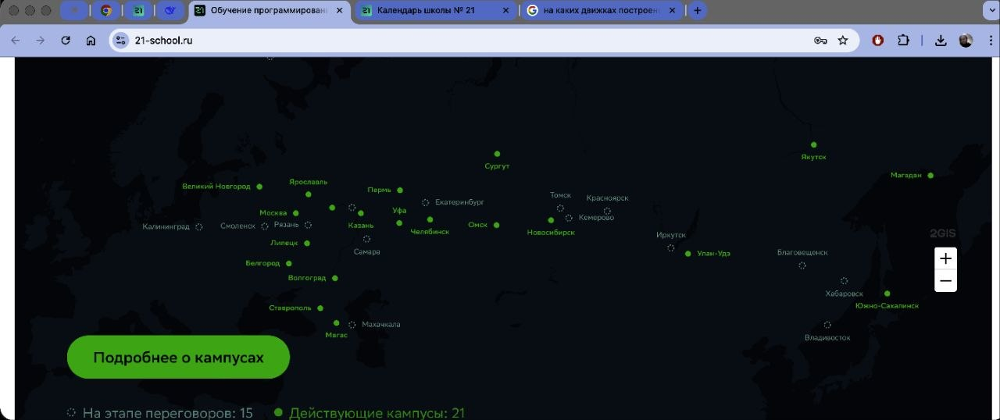
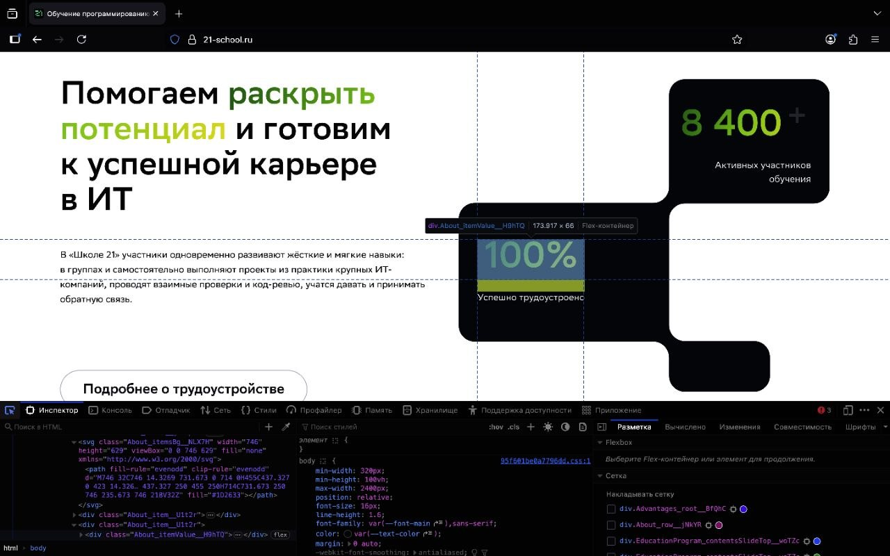
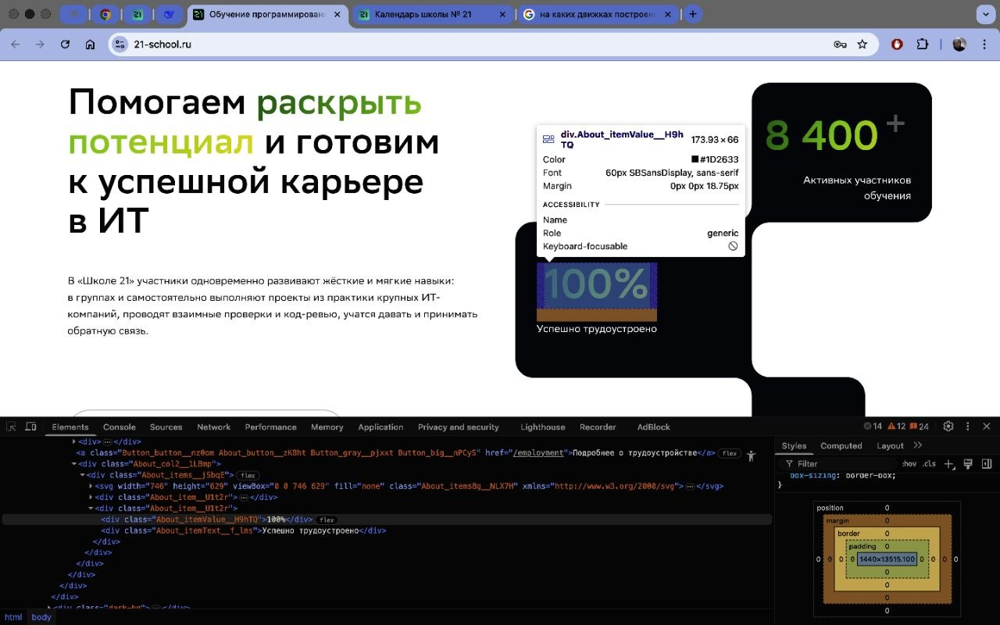
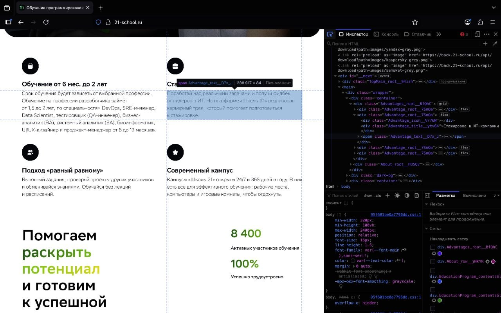
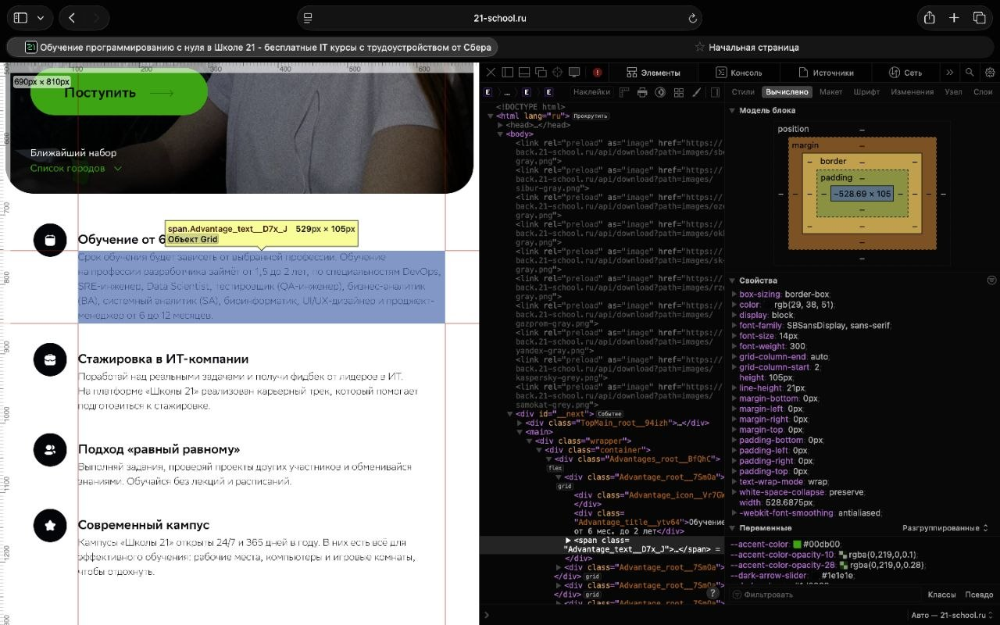

## Движки браузеров
Так как Microsof Edge и Coogle Chrome построенны на одном движке (Blink), Выбор пал на Google Chrome и Firefox(движок Gecko)
|Проверяемый элемент|Конкретное отличие (Что различается и в каких браузерах)|Предполагаемая техническая причина отличия|Номер/название скриншотов, где видны отличия в отображении элементов|
|-------------------|-----------------------------------|-------------------------------|-----------------------|
|Основной заголовок ("Самый быстрый способ попасть в ИТ...")| Заметное различие в толщине шрифта. В Firefox заголовок выглядит тоньше и светлее, чем в Chrome, где он насыщеннее.|Разные алгоритмы рендеринга движках Gecko (Firefox) и Blink(Chrome, Edge)|w1.task_3.F.jpg   w1.task_3.G.jpg|
|Блок с преимуществами (Карточки "Стажировка", "Подход 'равный равному'" и др.)|Межстрочный интервал (line-height) внутри карточек в Firefox чуть больше, чем в Chrome, особенно заметно в описании "Современный кампус"|Различия в стандартных пользовательских стилях|w2.task_3.F.jpg   w2.task_3.G.jpg|
|Карта с интерактивными метками|Область карты, отведённая под контейнер iframe, в Firefox имеет другую относительную высоту. Карта может выглядеть чуть "сжатой" по вертикали|Движки по-разному рассчитывают итоговые размеры|w3.task_3.F.jpg w3.task_3.F2.jpg w3.task_3.G.jpg w3.task_3.G2.jpg|
|Декоративные цифры в кругах|Самый заметный дефект: В Firefox цифры (8 400, 100%) часто смещены по вертикали и не отцентрированы. Они находятся явно ниже, чем в Chrome где они расположены ровно по центру круга|Неправильное выравнивание Flexbox.Firefox иначе обрабатывает выравнивание содержимого|w5.task_3.F.jpg   - w5.task_3.G.jpg|
|Блок с преимуществами|Firefox: Больший межстрочный интервал. Chrome/Edge: Компактнее. Safari (предположение): Может быть ближе к Firefox или иметь свой уникальный интервал.|Разные базовые стили браузеров|w6.task_3.F.jpg   w6.task_3.S.jpg|

Основной заголовок
-  - 

Блок с преимуществами
-    - 

Карта с интерактивными метками
-  -  -  - 

Декоративные цифры в кругах
-    - 

Блок с преимуществами №1
-    - 

## Рекомендации разработчикам
 1. Используйте normalize.css. Это устранит базовые различия в отступах, размерах шрифтов и межстрочных интервалах между браузерами (как было видно в блоке преимуществ).  2. Тестируйте Flexbox/Grid-выравнивание в Firefox. Особенно центрирование текста и элементов (проблема с цифрами в кругах). Firefox часто по-другому рассчитывает базовую линию текста внутри контейнера. 