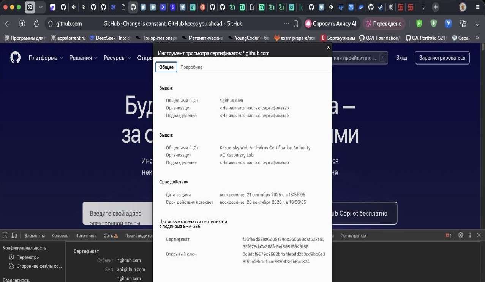
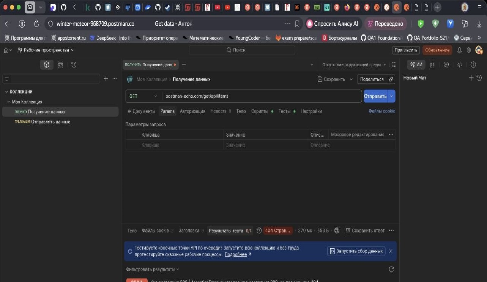
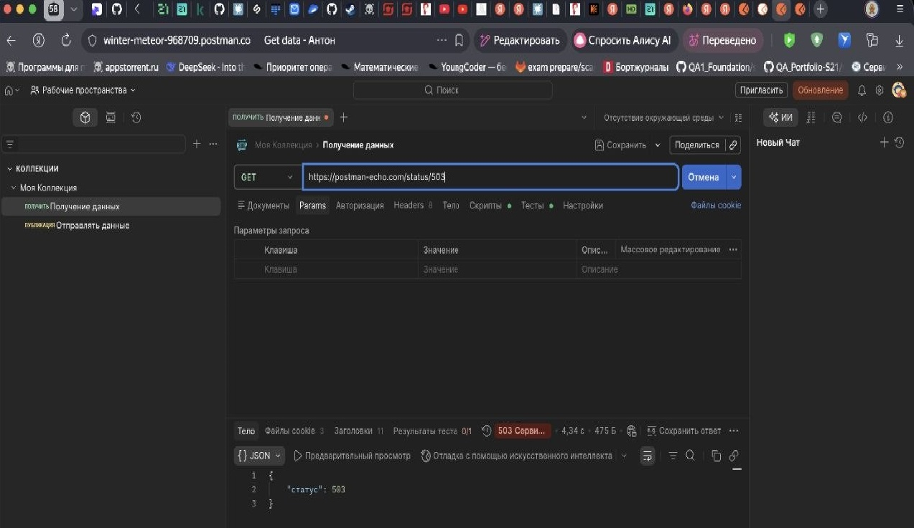

# Этапы установления защищенного соединения (HTTPS Handshake)

1. Client Hello (Приветствие клиента)
   - Цель: Клиент (браузер) сообщает серверу версию поддерживаемого протокола (TLS/SSL) и список доступных алгоритмов шифрования (шифросьютов), которые он готов использовать.
   - Устраняемый риск: Риск несовместимости протоколов и риск использования устаревших или небезопасных методов шифрования (если бы сервер сам выбирал алгоритм без ведома клиента).

2. Server Hello и отправка Сертификата
   - Цель: Сервер выбирает наилучший алгоритм шифрования из предложенных клиентом, подтверждает выбор и отправляет свой цифровой сертификат, содержащий публичный ключ сервера.
   - Устраняемый риск: Риск подключения к неизвестному источнику. Без сертификата клиент не знал бы, кому именно он передает данные.

3. Верификация сертификата (Проверка подлинности)
   - Цель: Браузер проверяет полученный сертификат: сверяет срок действия, доменное имя и, главное, проверяет цифровую подпись Центра Сертификации (CA), которому он доверяет.
   - Устраняемый риск: Атака "Человек посередине" (Man-in-the-Middle). Злоумышленник не сможет подделать сертификат, так как у него нет закрытого ключа доверенного Центра Сертификации для создания валидной подписи.

4. Обмен ключами (Key Exchange)
   - Цель: Клиент генерирует случайное значение (Pre-master secret), шифрует его публичным ключом сервера (из сертификата) и отправляет серверу. Только сервер, имеющий закрытый ключ, может расшифровать это сообщение.
   - Устраняемый риск: Перехват ключа шифрования. Даже если злоумышленник перехватит это сообщение, он не сможет его расшифровать без приватного ключа сервера.

5. Генерация сессионных ключей
   - Цель: И клиент, и сервер, используя полученный "Pre-master secret" и ранее обмененные случайные числа, независимо друг от друга генерируют одинаковые симметричные сессионные ключи.
   - Устраняемый риск: Риск низкой производительности. Асимметричное шифрование (используемое на предыдущих шагах) очень медленное. Этот этап позволяет перейти на быстрое симметричное шифрование для передачи основного объема данных.

6. Завершение соединения (Finished)
   - Цель: Обе стороны отправляют друг другу зашифрованное сообщение "Finished", которое содержит хеш (контрольную сумму) всех предыдущих сообщений рукопожатия.
   - Устраняемый риск: Риск подмены параметров соединения в процессе настройки. Если хеши не совпадут, соединение будет разорвано, так как это означало бы вмешательство третьей стороны в процесс согласования ключей.

---
## Часть 2: 
- Подключение - настройки безопасного подключения
Подключение к сайту зашифровано и аутентифицировано с использованием TLS 1.3, X25519 и AES 128 GCM

## Часть 3: Коды состояния HTTP (Шпаргалка тестировщика)

### Группа 1xx (Информационные)

| Код | Что видит пользователь | Что происходит на самом деле | Как проводить тестирование | Куда обращаться |
|-----|------------------------|------------------------------|---------------------------|-----------------|
| 100 Continue | Обычно ничего. Запрос продолжается без видимых изменений. | Сервер подтвердил получение заголовков запроса, клиент может отправлять тело (body). | Отправить запрос с большим телом (POST/PUT) и заголовком Expect: 100-continue. Проверить, что данные ушли после получения 100. | Бэкенд (DevOps/Backend) |

### Группа 2xx (Успех)

| Код | Что видит пользователь | Что происходит на самом деле | Как проводить тестирование | Куда обращаться |
|-----|------------------------|------------------------------|---------------------------|-----------------|
| 200 OK | Страница загрузилась, данные отобразились. | Запрос выполнен успешно. Сервер вернул запрашиваемые данные. | Базовый позитивный тест. Открыть страницу, отправить форму. | Фронтенд / Бэкенд (если данные не те) |
| 201 Created | Сообщение "Добавлено", редирект на новый элемент. | Ресурс успешно создан (например, добавлена запись в БД). Часто возвращает Location заголовок с URL нового ресурса. | POST запрос на создание объекта. Проверить наличие заголовка Location и статус в ответе. | Бэкенд |
| 204 No Content | Ничего не происходит визуально, действие выполнено. | Запрос успешен, но сервер не возвращает тело ответа (body пустой). Используется для удаления. | DELETE запрос. Проверить, что тело ответа пустое, а статус 204. | Бэкенд |

### Группа 3xx (Перенаправления)

| Код | Что видит пользователь | Что происходит на самом деле | Как проводить тестирование | Куда обращаться |
|-----|------------------------|------------------------------|---------------------------|-----------------|
| 301 Moved Permanently | URL в адресной строке меняется на новый. | Постоянный редирект. Браузер запоминает новый адрес. Поисковики перестают индексировать старый. | Проверить переход с HTTP на HTTPS или с www на non-www. Проверить, что старый URL не возвращает 200. | DevOps / Фронтенд |
| 302 Found (или 307) | Временный редирект. | Временный редирект. Старый URL остается валидным. | Проверить редиректы после логина (редирект на /profile). | Фронтенд / Бэкенд |
| 304 Not Modified | Страница загружается быстрее (из кэша). | Браузер отправил заголовок If-Modified-Since, сервер ответил, что контент не менялся. Тело ответа пустое. | Обновить страницу (F5) дважды. Посмотреть вкладку Network. | DevOps / Фронтенд (настройка кэширования) |

### Группа 4xx (Ошибки клиента)

| Код | Что видит пользователь | Что происходит на самом деле | Как проводить тестирование | Куда обращаться |
|-----|------------------------|------------------------------|---------------------------|-----------------|
| 400 Bad Request | "Некорректный запрос". | Сервер не может обработать запрос из-за синтаксической ошибки (например, невалидный JSON, неправильный тип данных). | Отправить JSON с лишней запятой, отправить текст вместо числа, передать неверный заголовок. | Бэкенд |
| 401 Unauthorized | Окно входа / "Требуется авторизация". | Отсутствует или неверный токен доступа (Authorization header). Пользователь не аутентифицирован. | Удалить токен из запроса. Отправить запрос с истекшим токеном. | Фронтенд / Бэкенд |
| 403 Forbidden | "Доступ запрещен". | Пользователь аутентифицирован, но у него нет прав на этот ресурс (например, обычный пользователь пытается зайти в админку). | Войти под обычной учетной записью и попытаться вызвать эндпоинт администратора. | Бэкенд (RBAC) |
| 404 Not Found | "Страница не найдена". | Ресурс по указанному URL не существует. | Вбить в адресную строку /page-ne-sushestvuet. Отправить GET на несуществующий ID. | Фронтенд (роутинг) / Бэкенд (роуты API) |
| 422 Unprocessable Entity | "Ошибка валидации" (подсвечиваются красным поля формы). | Сервер понял запрос и синтаксис, но не может выполнить из-за логических ошибок (например, email уже занят, пароль слишком короткий). | Попробовать зарегистрироваться с паролем "123". | Бэкенд |

### Группа 5xx (Ошибки сервера)

| Код | Что видит пользователь | Что происходит на самом деле | Как проводить тестирование | Куда обращаться |
|-----|------------------------|------------------------------|---------------------------|-----------------|
| 500 Internal Server Error | "Ошибка сервера. Повторите позже." (Общее сообщение). | Необработанное исключение в коде сервера (NullReference, Syntax Error в рантайме, падение БД). | Создать сценарий, приводящий к багу в бэкенде (деление на ноль, отправка null вместо объекта). | Бэкенд (DevOps для логов) |
| 502 Bad Gateway | "Шлюз выдал неверный ответ". | Сервер (nginx) получил невалидный ответ от вышестоящего сервера (приложение упало, php-fpm не отвечает). | Остановить бэкенд-сервис при запущенном nginx. | DevOps |
| 503 Service Unavailable | "Сайт на техобслуживании" или "Сервер перегружен". | Сервер временно не может обработать запросы (обычно из-за перегрузки или намеренного отключения). | Нагрузить сервер большим количеством параллельных запросов (Load testing) или проверить при выключении maintenance mode. | DevOps |
| 504 Gateway Timeout | "Шлюз не дождался ответа". | Сервер (proxy) не дождался ответа от апстрима (бэкенда) в течение установленного таймаута (обычно 30-60 сек). | На бэкенде повесить sleep(120) или долгий SQL запрос. | Бэкенд / DevOps |

---

## Часть 4: Тестирование API (Практическая часть)

В качестве общедоступного API выбраны Postman 

### Сценарий 1: Несушествующая страница (4xx)

| Параметр | Значение |
|----------|---------|
| Цель | Получить код 404 Not found |
| Метод | POST |
| URL | https://postman-echo.com/get/api/items |
| Тело запроса | {1} |
| Результат | Сервер вернул код 404, ошибки сервера |

#### Результат запроса:

## Сценарий 1: 503 Service Unavailable (503)

| Параметр | Значение |
|----------|---------|
| Цель | Получить код 503 Service Unavailable |
| Метод | POST |
| URL | https://postman-echo.com/status/503 |
| Тело запроса | {   "status": 503 } |
| Результат | Сервер вернул код 503|

#### Результат запроса:
