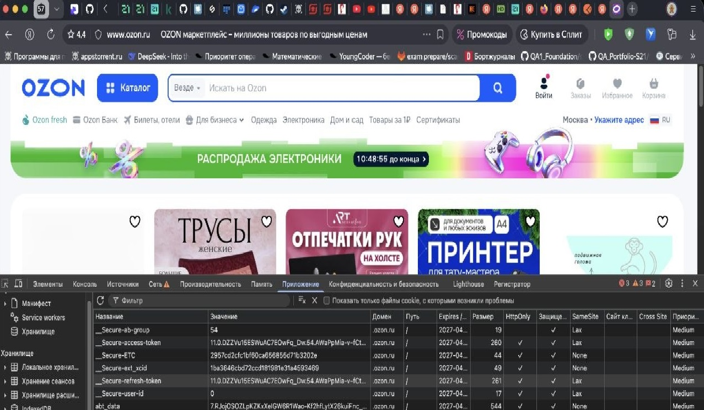
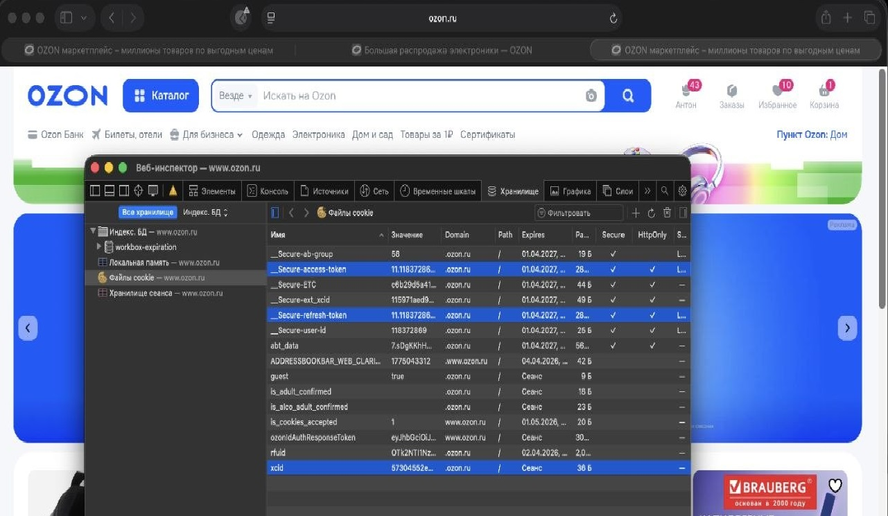
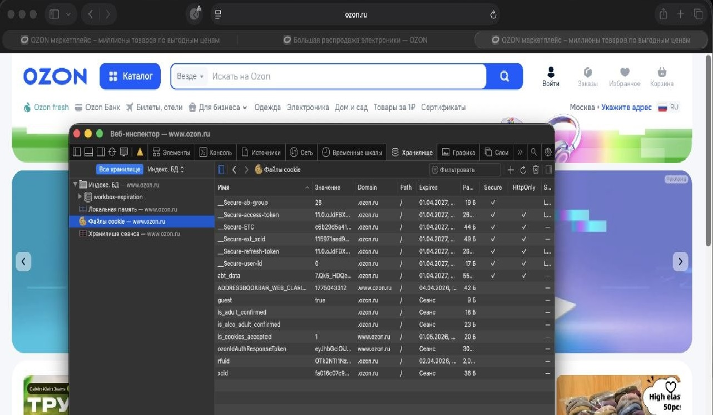

## Cookies 
Ответы на вопросы  адрес сайта https://www.ozon.ru/ 
|имя|тип|предполагаемое назначение| 
|---|---|-------------------------| 
|Secure-ab-group| Функциональная (не для трекинга)  First-party (с вашего сайта)  Префиксная (Secure- = требует HTTPS)  HttpOnly (обычно, для защиты)| Хранит только метку группы теста, чтобы:  Показывать пользователю одну и ту же версию при повторных визитах  Собирать статистику по разным группам| 
|Secure-access-token| Аутентификационная (сессионная/авторизационная) First-party (вашего сайта) Префиксная (Secure- = требует HTTPS) HttpOnly (почти всегда, для защиты от XSS) Secure (только по HTTPS)|Хранит доказательство авторизации, чтобы: Пользователь оставался в системе между сессиями Сервер мог идентифицировать пользователя без повторного входа |Ограничивать доступ к защищенным ресурсам |
|Secure-user-id| Аналитическая/функциональная (идентификация пользователя) First-party (вашего сайта) Префиксная (Secure- = требует HTTPS) Часто без HttpOnly (может использоваться фронтендом) Secure (только по HTTPS)|Хранит уникальный идентификатор пользователя, чтобы: Связывать действия пользователя в рамках одной сессии/визита Персонализировать контент без полной аутентификации Собирать аналитику по поведению конкретного пользователя Восстанавливать корзину покупок/состояние при повторном визите|
|guest| Аналитическая/Функциональная (отслеживание анонимных пользователей) First-party (вашего сайта) Без префикса (может работать по HTTP) HttpOnly Нет (используется фронтендом) Secure (если сайт на HTTPS)| Обычно хранит только уникальный ID (например, guest_id=abc123) Позволяет backend-системе или CDP «знать», что все действия от этого ID принадлежат одному анониму Не хранит список тестов или статистику на клиенте напрямую из соображений безопасности и объема данных|
|Secure-refresh-token| Аутентификационная (для обновления сессии) First-party (вашего сайта) Префиксная (Secure- = требует HTTPS) HttpOnly (всегда, максимальная защита) Secure (только по HTTPS) SameSite=Strict/Lax (защита от CSRF)|Хранит долгоживущий токен обновления, чтобы: Получать новые access-токены без повторного логина Поддерживать долгосрочные сессии (недели/месяцы) Обновлять access-токены после их истечения Отзывать доступ (инвалидация refresh-токена)|

5 
| Флаг | Рекомендуемое значение | Назначение |
| :--- | :--- | :--- |
| Secure | ✅ Должен быть установлен | Гарантирует, что cookie передается браузером только по защищенному протоколу HTTPS. Это предотвращает перехват cookie при атаках типа "человек посередине" (Man-in-the-Middle) на незащищенных сетях. |
| HttpOnly | ✅ Должен быть установлен | Запрещает доступ к cookie из клиентского JavaScript-кода. Это ключевая защита от кражи cookie с помощью межсайтового скриптинга (XSS-атак). |
| SameSite | ✅ Lax или Strict | Ограничивает отправку cookie при переходах с других сайтов. SameSite=Lax — это современный стандарт, который защищает от межсайтовой подделки запросов (CSRF-атак), не нарушая при этом навигацию по ссылкам. SameSite=Strict обеспечивает максимальную защиту, но может сломать некоторые сценарии перехода с внешних сайтов. |
## Настройка считается безопасной, если для критических cookie (содержащих токен сессии или авторизацию) выполняются три условия:

Флаг Secure: Установлен ✅. Это гарантирует, что браузер отправит cookie только по HTTPS, защищая от перехвата в незащищенных сетях.

Флаг HttpOnly: Установлен ✅. Это запрещает доступ к cookie через JavaScript, что защищает от кражи при XSS-атаках (межсайтовый скриптинг).

Атрибут SameSite: Имеет значение Lax или Strict ✅. Это ограничивает отправку cookie со сторонних сайтов, защищая от CSRF-атак (межсайтовая подделка запроса).

Если хотя бы один из этих флагов отсутствует или для SameSite выставлено значение None без Secure, такую конфигурацию следует считать небезопасной, так как она увеличивает поверхность для атак.

## 6
 При добавлении товара в корзину появляется __Secure-ab-group,
до добавления товара в корзину, этого флага не было. 
флаг _Secure- критичность высокая
HttpOnly: false
SameSite: Lax 

## 7
xcid,Secure-access-token,Secure-refresh-token 3 сессионных флага, которые отвечают за авторизацию.

