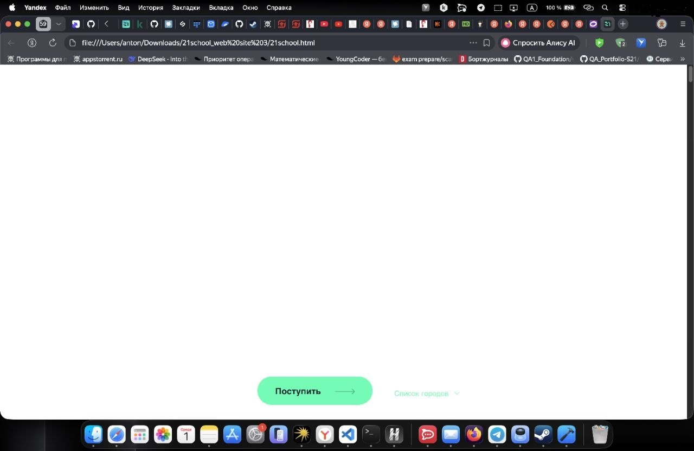
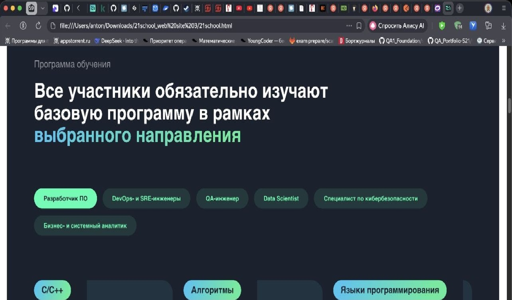
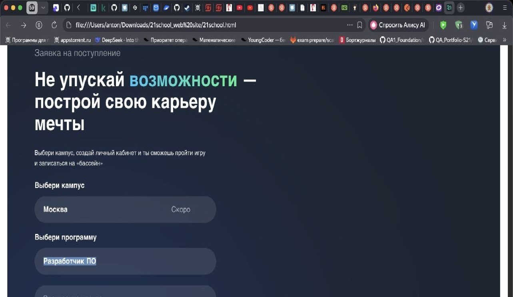

## Баг-репорт
## 1. Хедер
 1.Бесплатная школа цифровых технологий[Главная страница] [Блок Хедер]
 2.Приоритет: Средний (Medium)
 3.Серьезность:Незначительный (Minor/Medium)
 Ответственный (Assignee): razpab1
 Фронтенд-разработчик
 4.Описание проблемы : на сайте присутствует меню хедера, на макете он отсутствует 
 5.Шаги для воспроизведения 
 5.1.Перейти на главную страницу сайта 
 5.2.Сравнить реализацию с макетом 
 5.3.Наблюдаемое расхождение: наличие кнопки хедер
 6.Ожидаемый результат: Визуальное оформление  полностью соответствует макету
 7.Фактический результат: Визуальное оформление не соответствует макету

## 2.Логотип 
 1.Отсутствие логотипа
 2.Приоритет:Высокий 
 3.Серьезность:Тривиальный 
 Ответственный (Assignee): razpab1
 Фронтенд-разработчик
 4.Описание проблемы: на сайте есть логотип, на макете он отсутвует 
 5.Шаги для воспроизведения:
 5.1.Перейти на главную страницу сайта 
 5.2.Сравнить реализацию с макетом 
 5.3.Наблюдаемое расхождение: наличие логотипа
 6.Ожидаемый результат: Визуальное оформление  полностью соответствует макету
 7.Фактический результат: Визуальное оформление не соответствует макету
   -  

## 3.Цветовая палитра 
 1.Программа обучения [Главная страница] [Блок  гибкий график]
 2.Приоритет: Средний (Medium)
 3.Серьезность:Незначительный (Minor/Medium)
 Ответственный (Assignee): razpab1
 Фронтенд-разработчик
 4.Описание проблемы : на сайте сделано все в зеленых тонах, на макете в голубых
 5.Шаги для воспроизведения 
 5.1.Перейти на главную страницу сайта 
 5.2.Сравнить реализацию с макетом 
 5.3.Наблюдаемое расхождение: цветовая палитра
 6.Ожидаемый результат: Визуальное оформление  полностью соответствует макету
 7.Фактический результат: Визуальное оформление не соответствует макету 
-  

## Заявка на поступление 
 1.Отсутствие скролла выбора программы [Блок: Не упускай возможность- построй карьеру мечты]
 2.Приоритет:Высокий 
 3.Серьезность:Незначительный
 Ответственный (Assignee): 
 Фронтенд-разработчик
 4.Описание проблемы: на сайте отсутвует выбор программы обучения, на макете есть
 5.Шаги для воспроизведения:
 5.1.Перейти на главную страницу сайта 
 5.2.Пролистнуть до блока "Не упускай возможность- построй карьеру мечты"
 5.3.Сравнить реализацию с макетом 
 5.4.Наблюдаемое расхождение: Вход по сбер ID в макете отсутствует
 6.Ожидаемый результат: Визуальное оформление  полностью соответствует макету
 7.Фактический результат: Визуальное оформление не соответствует макету
   - 