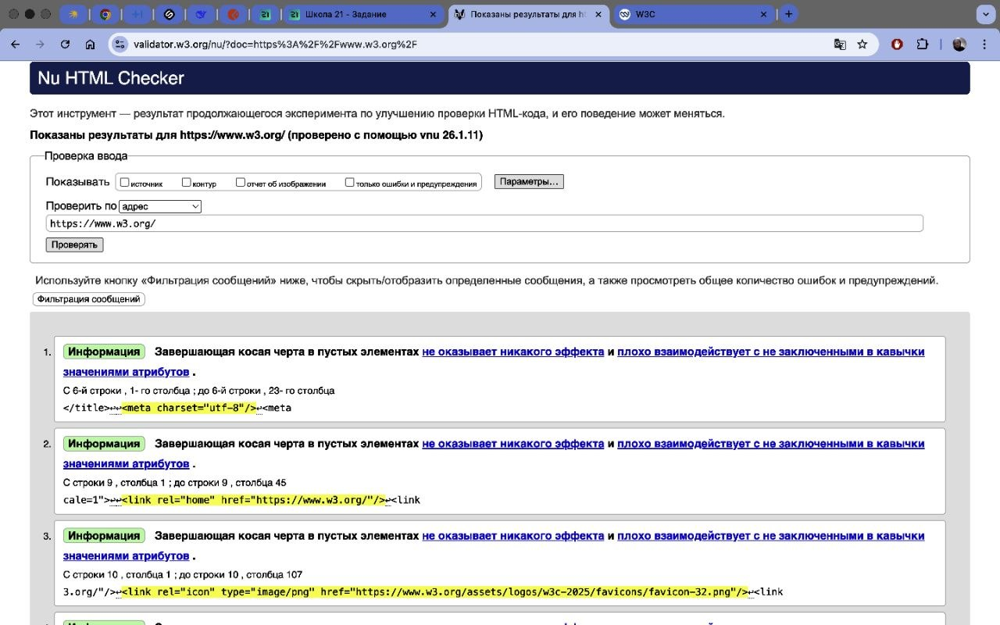
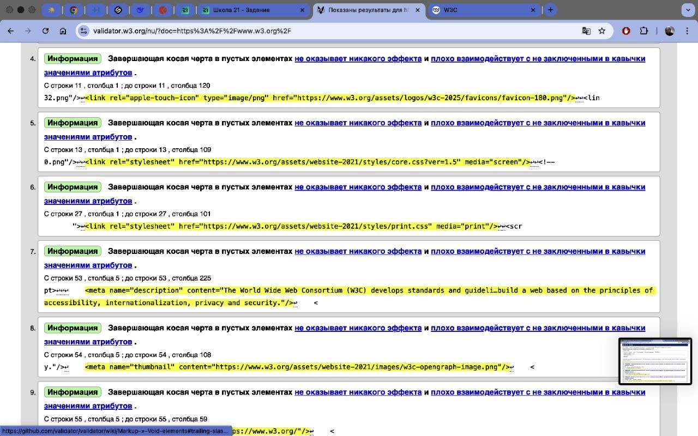
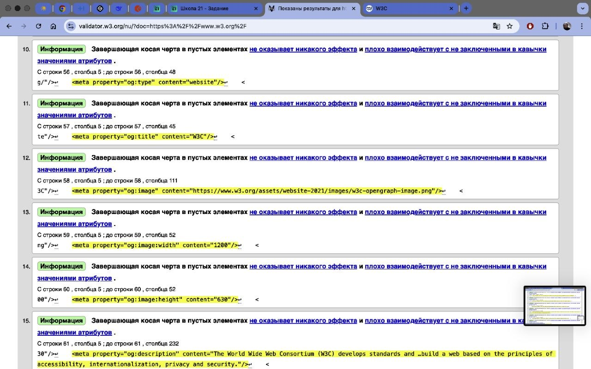
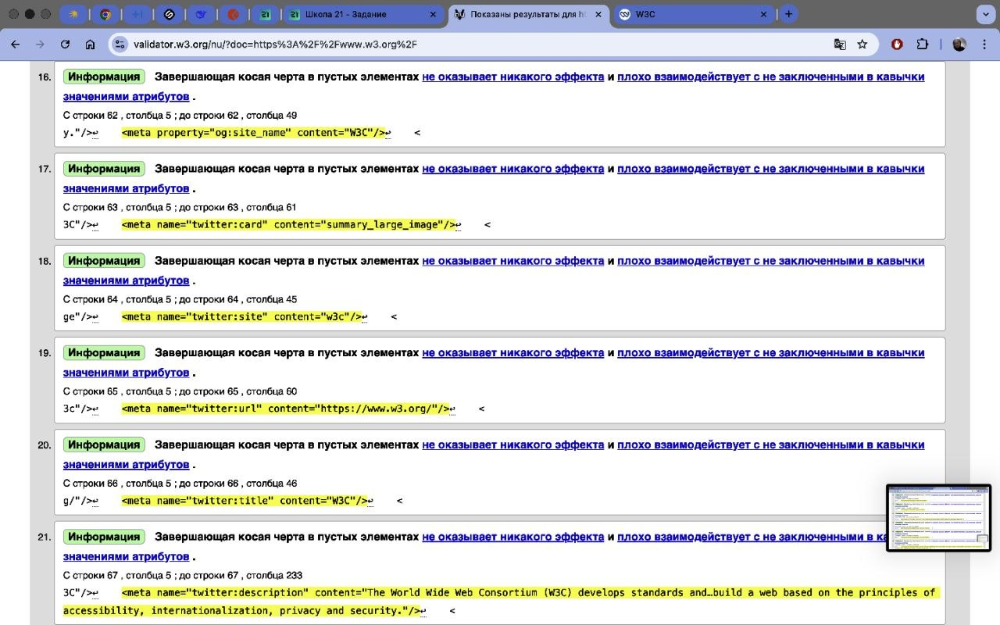
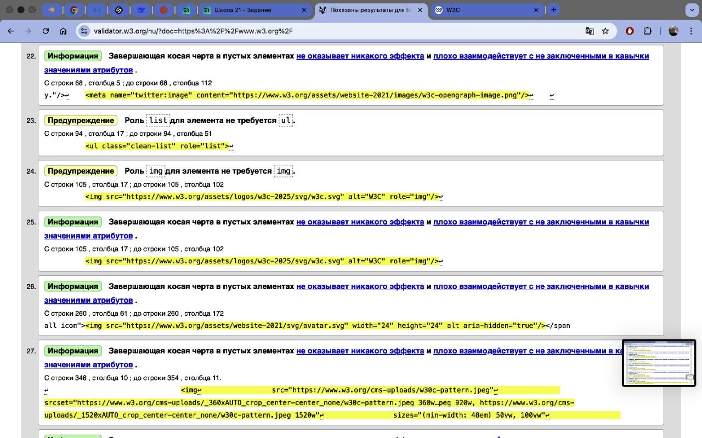

## Отчет о валидации с помощью https://validator.w3.org/ 

1.Название и адрес сайта:
World Wide Web Consortium (W3C), https://www.w3.org/
*Анализ доступного контента:*
Общее количество ошибок
 Средний приоритет : 5  Информационные сообщения(Низкий приоритет): 27  Критические ошибки: 0

Количество критичных ошибок
 На странице нет критических ошибок, нарушающих базовую функциональность, отображение или валидность HTML-документа.
наличие ошибок доступности

Самые частые типы ошибок
 Роль list для элемента не требуется ul.(Избыточное объявление ARIA-ролей. Элементы)
качество HTML-структуры
Завершающая косая черта в пустых элементах (Использование символа / в самозакрывающихся тегах)

Наличие ошибок доступности
Есть несколько ошибок.  Нейтрально: Наличие избыточных ARIA-ролей (role="list", role="img") не вредит доступности, но и не помогает. Они могут быть удалены для упрощения кода.  Требует проверки: В строках 348, 367 и 386 у изображений-декораций установлен пустой атрибут alt="". Это правильная практика для скринридеров, но стоит визуально убедиться, что эти изображения действительно не несут информационной нагрузки.
Качество HTML-структуры
Отличное.HTML-код соответствует современным стандартам HTML5, использует семантические теги и логично структурирован. Полное отсутствие критических ошибок валидации

Приоритет:

Высокий приоритет: Отсутствуют. Критических ошибок, требующих немедленного вмешательства, нет. 

-  

-  

-  

-  

-  

- 